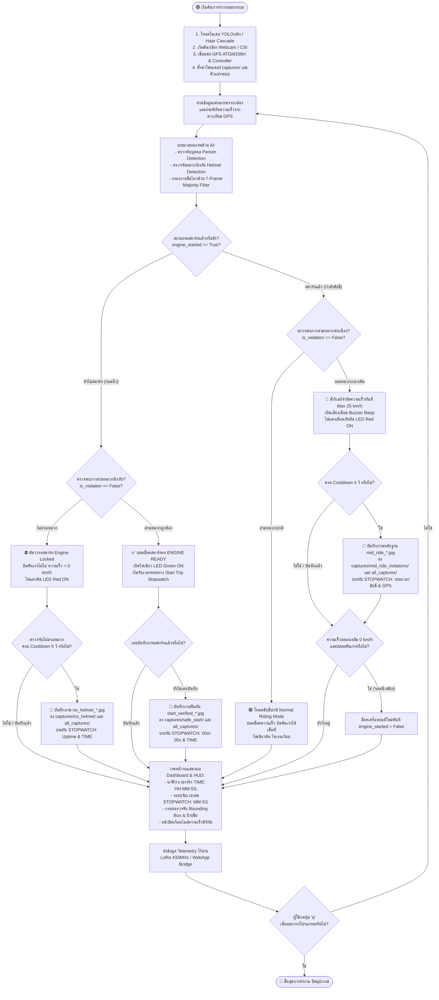
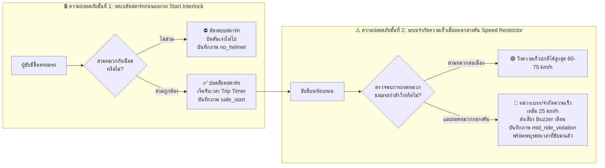

# 📊 แผนผังการทำงานของระบบ (System Flowchart)
## ระบบตรวจจับหมวกนิรภัยสำหรับรถมอเตอร์ไซค์ไฟฟ้า (Smart Helmet Detection & Two-Tier Safety Interlock)

---

## 1. ผังงานรวมการทำงานของระบบ (Overall System Flowchart)

---

## 2. ผังงานตรรกะความปลอดภัย 2 ชั้น (Two-Tier Safety Interlock Logic)

---

## 3. ตารางสถานะการทำงานของระบบ (State Transition Table)

| สถานะของรถ | การตรวจจับหมวก | สวิตช์รีเลย์สตาร์ท | รีเลย์จำกัดความเร็ว | ไฟ LED | เสียงเตือน Buzzer | โฟลเดอร์ที่บันทึกภาพ | ลายน้ำที่ประทับลงภาพ (Watermark) |
| :--- | :---: | :---: | :---: | :---: | :---: | :---: | :--- |
| **ก่อนสตาร์ท / จอดนิ่ง** | ❌ ไม่สวม | **LOCKED (ตัดไฟ)** | ทำงาน (ตัดคันเร่ง) | 🔴 แดง | เงียบ/เตือน | `captures/no_helmet/` | `[ALERT] NO HELMET DETECTED \| STOPWATCH: 00m 25s \| ENGINE LOCKED` |
| **ก่อนสตาร์ท / จอดนิ่ง** | ✅ สวมถูกต้อง | **UNLOCKED (พร้อมขับ)** | ปลดล็อค | 🟢 เขียว | เงียบ | `captures/safe_start/` | `[PASS] SAFE START \| HELMET VERIFIED \| STOPWATCH: 00m 00s` |
| **กำลังขับขี่บนถนน** | ✅ สวมต่อเนื่อง | **UNLOCKED** | ปลดล็อคปกติ | 🟢 เขียว | เงียบ | *(ไม่บันทึกภาพซ้ำ)* | *(ขับขี่ความเร็วปกติ)* |
| **กำลังขับขี่บนถนน** | ❌ แอบถอดกลางคัน | **UNLOCKED** | **ACTIVE (ล็อค 25 km/h)** | 🔴 แดง | **ดังเตือน (BEEP)** | `captures/mid_ride_violations/` | `[ALERT] MID-RIDE HELMET REMOVAL \| STOPWATCH: 02m 15s \| SPEED: 38.5 KM/H` |
| **ทุกสภาวะ** | กดปุ่ม `[S]` | ตามสภาวะขณะนั้น | ตามสภาวะขณะนั้น | ตามสภาวะ | เงียบ | `captures/manual_snapshots/` | `MANUAL SNAPSHOT \| {STATUS} \| STOPWATCH: {TIME}` |

> 💡 **หมายเหตุ**: ทุกภาพที่บันทึกจะถูกทำสำเนาส่งไปยังโฟลเดอร์รวม `captures/all_captures/` โดยอัตโนมัติ เพื่อให้ตรวจสอบรูปภาพทั้งหมดได้ในที่เดียว

---

## 4. คำอธิบายขั้นตอนการทำงานอย่างละเอียด (สำหรับใส่เล่มรายงาน บทที่ 3)

### ขั้นตอนที่ 1: การเตรียมความพร้อมของระบบ (System Initialization)
เมื่อเปิดสวิตช์กุญแจรถมอเตอร์ไซค์ไฟฟ้า บอร์ดประมวลผลจะโหลดโมเดลปัญญาประดิษฐ์ YOLOv8n, เปิดกล้องดิจิทัลมุมกว้าง, เริ่มต้นการเชื่อมต่อดาวเทียม GPS, และสร้างโครงสร้างโฟลเดอร์จัดเก็บหลักฐาน โดยระบบจะตั้งค่าเริ่มต้นให้ **"เครื่องยนต์ถูกล็อค (Engine Locked)"** เสมอเพื่อความปลอดภัย

### ขั้นตอนที่ 2: การประมวลผลภาพและการกรองความผิดพลาด (AI Detection & Noise Filtering)
กล้องจะจับภาพผู้ขับขี่อย่างต่อเนื่องและส่งเข้าสู่โมเดลตรวจจับวัตถุเพื่อค้นหาตำแหน่งบุคคล (Person) และจำแนกศีรษะว่าสวมหมวกนิรภัย (Helmet) หรือไม่สวมหมวก (No Helmet) โดยใช้ **7-Frame Majority Filter** และ **สัดส่วนกายวิภาคศาสตร์มนุษย์ (Anatomical Ratio)** เพื่อลดการสั่นไหวของกรอบและป้องกันการระบุสถานะผิดพลาดจากการกะพริบของแสง

### ขั้นตอนที่ 3: การบังคับใช้ความปลอดภัยชั้นที่ 1 (Start Interlock Enforcement)
- หากผู้ขับขี่ **ไม่สวมหมวกนิรภัย**: รีเลย์จะตัดวงจรคันเร่ง รถไม่สามารถเคลื่อนที่ได้ พร้อมบันทึกภาพหลักฐาน `no_helmet_*.jpg`
- หากผู้ขับขี่ **สวมหมวกนิรภัยถูกต้อง**: ระบบจะปลดล็อคให้สตาร์ทเครื่องยนต์ได้ พร้อมบันทึกภาพยืนยัน `start_verified_*.jpg` และเริ่มนับเวลาจับเวลาการเดินทาง (Live Trip Stopwatch)

### ขั้นตอนที่ 4: การบังคับใช้ความปลอดภัยชั้นที่ 2 ขณะขับขี่ (Mid-Ride Violation Enforcement)
เมื่อรถเริ่มเคลื่อนที่ ระบบจะตรวจสอบการสวมหมวกอย่างต่อเนื่อง:
- หากสวมหมวกตามปกติ ผู้ขับขี่จะสามารถเร่งความเร็วได้ตามขีดจำกัดของรถ
- หากผู้ขับขี่ **แอบถอดหมวกนิรภัยขณะรถกำลังวิ่ง**: ระบบจะสั่งรีเลย์จำกัดความเร็วให้ลดลงเหลือไม่เกิน 25 km/h ทันที เพื่อป้องกันอุบัติเหตุรุนแรง พร้อมส่งเสียงเตือน และบันทึกภาพถ่ายหลักฐาน `mid_ride_*.jpg` ประทับเวลาขับขี่และความเร็วจริงขณะกระทำผิด

### ขั้นตอนที่ 5: การประทับเวลาและส่งข้อมูลโทรมาตร (Telemetry & Logging)
ข้อมูลสถานะ, พิกัด GPS, วันเวลาจริง, และเวลาที่จับเวลาได้จะถูกส่งผ่านคลื่นวิทยุไร้สาย (LoRa / Telemetry Bridge) ไปยังศูนย์ควบคุมหรือหน้าจอแสดงผล และบันทึกลงในล็อกไฟล์ JSON ประจำวันแบบกล่องดำ (Black Box)
