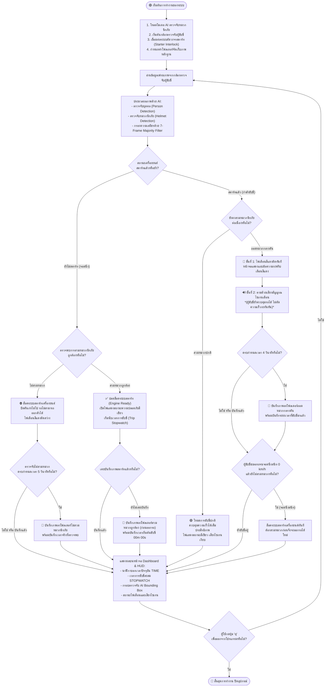
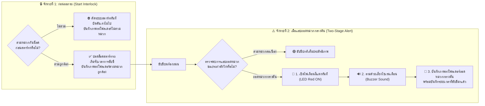

# 📊 แผนผังการทำงานของระบบ (System Flowchart)
## ระบบตรวจจับหมวกนิรภัยสำหรับรถมอเตอร์ไซค์ไฟฟ้า (Smart Helmet Detection & Safety Alert System)

---

## 1. ผังงานรวมการทำงานของระบบ (Overall System Flowchart)

---

## 2. ผังงานตรรกะการควบคุมและเตือนภัย 2 ระดับ (Two-Stage Safety & Alert Logic)

---

## 3. ตารางสถานะการทำงานของระบบ (State Transition Table)

| สถานะของรถ | การตรวจจับหมวก | ระบบตัดต่อสตาร์ท (Interlock) | ความเร็วมอเตอร์ | ไฟเตือน LED | เสียงเตือน Buzzer | โฟลเดอร์ที่บันทึกภาพ | ลายน้ำที่ประทับลงภาพ (Watermark) |
| :--- | :---: | :---: | :---: | :---: | :---: | :---: | :--- |
| **ก่อนสตาร์ท / จอดนิ่ง** | ❌ ไม่สวม | **LOCKED (ตัดไฟสตาร์ท)** | บิดไม่ไป (0 km/h) | 🔴 ไฟแดงติด | เงียบ | โฟลเดอร์ไม่สวมหมวก (`no_helmet/`) | `[ALERT] NO HELMET DETECTED | STOPWATCH: 00m 25s | ENGINE LOCKED` |
| **ก่อนสตาร์ท / จอดนิ่ง** | ✅ สวมถูกต้อง | **UNLOCKED (พร้อมขับ)** | พร้อมบิดคันเร่ง | 🟢 ไฟเขียวติด | เงียบ | โฟลเดอร์สวมหมวกถูกต้อง (`safe_start/`) | `[PASS] SAFE START | HELMET VERIFIED | STOPWATCH: 00m 00s` |
| **กำลังขับขี่บนถนน** | ✅ สวมต่อเนื่อง | **UNLOCKED** | วิ่งความเร็วปกติ | 🟢 ไฟเขียวติด | เงียบ | *(ไม่บันทึกซ้ำ)* | *(ขับขี่ความเร็วปกติ)* |
| **กำลังขับขี่บนถนน** | ❌ แอบถอดกลางคัน | **UNLOCKED** | **ไม่ตัดความเร็ว (วิ่งต่อได้)** | **🔴 1. ไฟแดงเตือนขึ้นก่อน** | **🔊 2. ตามด้วยเสียงเตือนดัง** | โฟลเดอร์ถอดหมวกกลางคัน (`mid_ride_violations/`) | `[ALERT] MID-RIDE HELMET REMOVAL | STOPWATCH: 02m 15s | TIME: ...` |
| **ทุกสภาวะ** | กดปุ่ม `[S]` | ตามสภาวะขณะนั้น | ตามสภาวะขณะนั้น | ตามสภาวะ | เงียบ | โฟลเดอร์บันทึกภาพด้วยตนเอง (`manual_snapshots/`) | `MANUAL SNAPSHOT | {STATUS} | STOPWATCH: {TIME}` |

> 💡 **หมายเหตุ**: ระบบจะแยกจัดเก็บภาพหลักฐานตามโฟลเดอร์เหตุการณ์อย่างเป็นระเบียบ เพื่อให้สะดวกต่อการตรวจสอบและสืบค้น

---

## 4. คำอธิบายขั้นตอนการทำงานอย่างละเอียด (สำหรับใส่เล่มรายงาน บทที่ 3)

### ขั้นตอนที่ 1: การเริ่มต้นระบบ (System Initialization)
เมื่อเปิดสวิตช์กุญแจรถมอเตอร์ไซค์ไฟฟ้า บอร์ดประมวลผล (Raspberry Pi 4) จะโหลดโมเดลปัญญาประดิษฐ์ตรวจจับวัตถุ, เปิดกล้องดิจิทัลตรวจจับผู้ขับขี่, และสร้างโครงสร้างโฟลเดอร์จัดเก็บภาพหลักฐาน โดยระบบจะตั้งค่าเริ่มต้นให้ **"ระบบสตาร์ทเครื่องยนต์ถูกล็อค (Engine Locked)"** เสมอเพื่อความปลอดภัย

### ขั้นตอนที่ 2: การประมวลผลภาพจากกล้อง (AI Vision Processing)
กล้องจะจับภาพผู้ขับขี่อย่างต่อเนื่องและส่งเข้าสู่โมเดลตรวจจับวัตถุ เพื่อระบุตำแหน่งบุคคล (Person) และตรวจสอบสภาวะของศีรษะว่าสวมหมวกนิรภัย (Helmet) หรือไม่สวมหมวก (No Helmet) โดยใช้ **7-Frame Majority Filter** ร่วมกับ **สัดส่วนกายวิภาคศีรษะมนุษย์ (Human Anatomical Ratio)** เพื่อให้กรอบตรวจจับนิ่งเสถียร ไม่กะพริบวูบวาบ

### ขั้นตอนที่ 3: การบังคับสวมหมวกก่อนออกรถ (Start Interlock)
- หากผู้ขับขี่ **ไม่สวมหมวกนิรภัย**: ระบบตัดต่อสตาร์ท (Interlock) จะตัดวงจรคันเร่ง บิดไม่ไป รถไม่สามารถออกตัวได้ พร้อมบันทึกภาพลงโฟลเดอร์ไม่สวมหมวกนิรภัย
- หากผู้ขับขี่ **สวมหมวกนิรภัยถูกต้อง**: ระบบจะปลดล็อคให้สตาร์ทรถได้ทันที (ENGINE READY), เปิดไฟเขียวแสดงความปลอดภัย, บันทึกภาพลงโฟลเดอร์สวมหมวกถูกต้อง (ก่อนออกรถ) และเริ่มนับเวลาการขับขี่ (Live Trip Stopwatch)

### ขั้นตอนที่ 4: การแจ้งเตือนเมื่อแอบถอดหมวกกลางคัน (Two-Stage Mid-Ride Warning Alert)
ขณะที่รถกำลังวิ่งบนท้องถนน หากผู้ขับขี่แอบถอดหมวกนิรภัยกลางคัน ระบบจะ **ไม่ตัดความเร็วกะทันหัน** เพื่อป้องกันอันตรายจากการเสียหลักหรือการถูกชนท้าย แต่จะใช้ **ระบบเตือนภัย 2 จังหวะ**:
1. **จังหวะที่ 1 (เตือนด้วยสายตา)**: แสดงไฟเตือนสีแดง (LED Red Alert) สว่างขึ้นทันที พร้อมหน้าจอกะพริบแจ้งเตือนสีแดง
2. **จังหวะที่ 2 (เตือนด้วยเสียง)**: ตามด้วยเสียงสัญญาณไซเรนเตือน (Buzzer Alarm Beep) ส่งเสียงเตือนต่อเนื่องให้ผู้ขับขี่รู้ตัวและนำหมวกกลับมาสวมใส่
3. **การบันทึกหลักฐาน**: ระบบบันทึกภาพลงโฟลเดอร์ถอดหมวกกลางคัน พร้อมประทับเวลาที่ขับขี่มาแล้ว (Trip Stopwatch) เพื่อเป็นหลักฐานว่ามีการถอดหมวกหลังจากขับขี่ไปนานเท่าใด
4. **เมื่อรถจอดนิ่งสนิท**: หากผู้ขับขี่หยุดรถแล้วยังไม่สวมหมวก ระบบจะทำการล็อคระบบสตาร์ทใหม่อีกครั้งทันที
